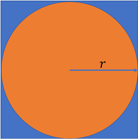

[](https://classroom.github.com/a/MkIvqVp1)
# COMP100 2024F Lab 04 PreLab:

## Deadline: Friday, 08 November 2024, 10:00 AM

The test cases given are just sample tests, and additional test cases may be used while grading.

# Question 1: Pi Estimation with Dart Game (50 Points)

Write a function `estimate_pi_dart_game` to estimate $\pi$ using a dart-throwing simulation. In this game, a circle (dartboard) is inscribed in a square, and darts are randomly thrown at the square. The ratio of darts landing inside the circle to the total number of darts estimates the value of $\pi$.

The figure below illustrates this setup, where the circle (representing the dartboard) fits perfectly within a square:



### Concept

For large values of `N` (the total number of darts), the ratio of the **area of the circle** to the **area of the square** approximates the ratio of darts landing inside the circle to the total darts:

$$
\frac{\mathrm{Area_{circle}}}{\mathrm{Area_{square}}} \approx \frac{N_{circle}}{N_{total}}
$$

This relationship becomes more accurate as `N` increases, allowing for a reliable estimate of $\pi$ by calculating the area ratio.

### Parameters:

- `num_darts` (int): Total number of darts to throw.
- `radius` (float): Radius of the circle (dartboard).

### Returns:

- `pi_estimate` (float): Estimated value of $\pi$.

### Requirements

- **Random Module**: Use Python’s built-in `random` module to generate uniformly distributed x and y coordinates within the square.

### Example Usage:

```
print(estimate_pi_dart_game(110000, 1.8))  # Output should approximate 3.116
print(estimate_pi_dart_game(5000, 3.6))   # Output should approximate 3.1024
```

# Question 2: Estimating Joint Probability of Multiple Events (50 Points)

Write a function `estimate_joint_probability` to estimate the probability of rolling a sum that is either `first_target_sum` or `second_target_sum`, under the condition that both dice show different numbers.

### Concept

In this experiment, you will simulate rolling two six-sided dice multiple times to estimate the probability of two events occurring together:
1. The sum of the dice equals either `first_target_sum` or `second_target_sum`.
2. Both dice show different numbers (e.g., one die shows 3 and the other shows 4, not 3 and 3).

The probability can be estimated as:

$$
P(\text{sum} = \text{first target sum or second target sum and different numbers}) \approx \frac{\text{Number of rolls satisfying both conditions}}{\text{Total number of rolls}}
$$

This relationship becomes more accurate as the number of trials increases.

### Parameters:

- `num_trials` (int): The number of dice rolls to simulate.
- `first_target_sum` (int): The first target sum (e.g., 7).
- `second_target_sum` (int): The second target sum (e.g., 11).

### Returns:

- `probability` (float): The estimated probability of the event.

### Requirements

- **Random Module**: Use Python’s built-in `random` module to generate dice rolls uniformly from 1 to 6.

### Edge Case Handling

Your function should handle the below edge case:
- **Zero Trials**: When `num_trials` is `0`, return `0.0`, as no trials mean there’s no probability to estimate.

### Example Usage:

```
print(estimate_joint_probability(1000, 7, 11))  # Output should be a probability, e.g., 0.239 
print(estimate_joint_probability(500, 3, 8))    # Output should be a probability, e.g., 0.168
```