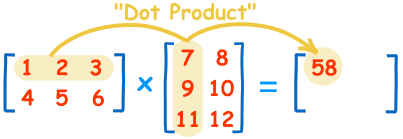

[](https://classroom.github.com/a/GGNLF2eV)
# COMP100 2024F Lab 06: Lists and Tuples - In Lab 12:00 PM
### Deadline Friday, November 22, 2024 01:40 PM

The testcases given are just sample tests, and additional testcases may be used while grading.

## Q1: Matrix Dimensions (10 Points)

Write a function `dims(m)` which takes a matrix `m` (a list of lists) and returns its dimensions as a tuple `(n_rows, n_columns)`.

#### Example Usage:

```python
m = [[1, 2], [3, 4], [5, 6]]
print(dims(m)) # Expected Output: (3, 2)
```

## Q2: Zero Matrix (20 Points)

Write a function `zeros(dim)` which takes a dimensions tuple and returns a matrix of that size filled with zeros.

#### Example Usage:

```python
dim = (2, 3)
print(zeros(dim)) # Expected Output: [[0, 0, 0], [0, 0, 0]]
```

## Q3: Gram Matrix (70 Points)

Gram matrix $G$ is a square matrix that is product of matrix $V$ and its transpose $V^T$ and represented as: $G=V.V^T$, where $.$ is matrix multiplication. This problem can be decomposed into calculating the transpose and matrix multiplication.

### A: Matrix Transpose (25 Points)

Write a function `transpose(m)` which takes a matrix `m` and returns its transpose matrix (also a list of lists).

Recall that in the transpose of a matrix the rows of the original matrix become columns and the columns become rows.

**Note**:
- Use `dims` function to get matrix dimensions.
- Use `zeros` function to allocate matrix of same size.

#### Example Usage:
```python
m = [[1, 2], [3, 4], [5, 6]]
print(transpose(m)) # Expected Output: [[1, 3, 5], [2, 4, 6]]
```

### B: Matrix Multiplication (35 Points)

Write a function `mat_mul(A, B)` which takes two matrices and returns their product (also a list of lists). If $\mathbf {A}$ is an $m \times n$ matrix and $\mathbf {B}$ is an $n \times p$ matrix, the matrix product $\mathbf {C}=\mathbf {A}\mathbf {B}$ (denoted without multiplication signs or dots) is defined to be the $m \times p$ matrix.

The entry $c_{ij}$ of the product obtained by multiplying term-by-term the entries of the $i$-th row of $\mathbf{A}$ and the $j$-th column of $\mathbf{B}$, and summing these $n$ products. In other words, $c_{ij}$ is the dot product of the $i$-th row of $\mathbf{A}$ and the $j$-th column of $\mathbf{B}$.

```math
c_{ij}=a_{i1}b_{1j}+a_{i2}b_{2j}+\cdots +a_{in}b_{nj}=\sum _{k=1}^{n}a_{ik}b_{kj},
```



Thus the product $\mathbf {A}\mathbf {B}$ is defined if and only if the number of columns in $\mathbf{A}$ equals the number of rows in $\mathbf {B}$, in this case $n$.

**Note**:
- Use `dims` function to get matrix dimensions.
- Use `zeros` function to allocate matrix $\mathbf {C}$ having dimensions $m \times p$.
- If the number of columns in $\mathbf{A}$ is not equal to the number of rows in $\mathbf{B}$, return `None`. 

#### Example Usage:
```python
A = [[1, 2], [3, 4], [5, 6]]
B = [[1, 2, 3], [4, 5, 6]]
print(mat_mul(A, B)) # Expected Output: [[9, 12, 15], [19, 26, 33], [29, 40, 51]]
```

### C: Gram Matrix (10 Points)

Leverage functions from parts A and B, write a function `gram_matrix(m)` that takes a matrix `m` and returns gram matrix, calculated by the formula given above.

#### Example Usage:
```python
A = [[1, 2, 3], [4, 5, 6], [7, 8, 9]]
print(gram_matrix(A)) # Expected Output: [[14, 32, 50], [32, 77, 122], [50, 122, 194]]
```
