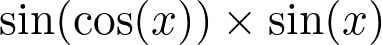
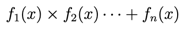
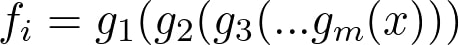
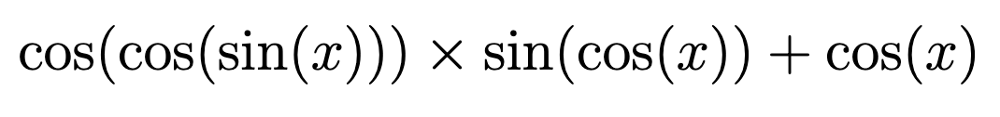

[](https://classroom.github.com/a/xXuw34lK)
# PS4 - Recursion
### Deadline: December 

In this assignment, you will learn how to apply recursion to solve different problems. Note that this assignment, like any other assignment, will be graded with additional different test cases. We will check your codes to make sure that your solutions use recursion.

* You **MUST USE RECURSION** in each question.
* You **MUST NOT USE GLOBAL VARIABLES** in any question.
* You **MUST NOT USE NESTED FUNCTIONS** in any question.
* You **MUST NOT USE** eval() function in any question.
* You **MUST NOT USE ITERATION AT ALL** (No, for or while loops, no iterating
over a list or string, No list or dictionary comprehensions, ..etc)
* You **CAN** and should use string builtin functions (Hint: However there is no
need to use .split())
## Question 1: Sin Cos 

In this question, we will be given a trigonometric function. for example:



and we want to calculate the value of this function and its derivative at a given `x`.

Assume that our function is a multiplication of one or more functions:



where each function **f(x)** is a composition of one or more functions:



and each function **g(x)** is either `sin(x)` or `cos(x)`.

For example, our input function can be:



**In other words, our function is created only by chaining `sin(x)` and `cos(x)` functions and multiplying, adding them together.**

* The function is represented as a string.
* The multiplication sign is represented using `'*'`.
* The addition sign is represented using `'+'`.
* There are **NO SPACES** anywhere in the input. For example, input can be `'sin(x)*cos(x)'` but not `'sin(x) * cos(x)'` 
* There is a pair of parenthesis corresponding to the input of each `sin` or `cos` function, and there are **no extra parentheses** anywhere in the input string. For example, input will not be `'sin(x)*(sin(cos(x)))'` because the second term has redundant parenthesis. Instead it can be `'sin(x)*sin(cos(x))'`

The above function will be represented as: `'cos(cos(sin(x)))*sin(cos(x))+cos(x)'`

In your implementation:

* You **ARE ALLOWED** to use the `math.sin()` and `math.cos()` functions.
* You **MUST NOT** use any other functions from the `math` library.
* You **MUST NOT** use any other libraries.
* You **MUST** implement each part using **RECURSION**.


### Q1 Part a:
Implement `calculate (f, x)`, where `f` is a string representing the trigonometric function described above, and `x` is a number in radians. `calculate(f, x)` should return the value of the function **f** at point **x**. Your implementation should be **RECURSIVE**.

---

#### Examples:
```
calculate('sin(cos(x))', 0.7) -> 0.6924231466313585
calculate('sin(cos(x))*sin(cos(sin(x)))*cos(x)', 1.2) -> 0.07212392761438038
calculate('sin(cos(x))+sin(cos(sin(x)))*cos(x)', 0.7) -> 1.2408580818878787
```
***

### Q1 Part b:
Implement `derivative(f, x)`, where `f` is a string representing the trigonometric function described above, and `x` is a number in radians. `derivative(f, x)` should return the value of the derivative of the function **f** at point **x**. Your implementation should be **RECURSIVE**.

* **Important:** `sin'(x) = cos(x)` and `cos'(x) = -sin(x)`
* **Important:** `f(g(x))' = f'(g(x)) * g'(x)` -> **chain rule**
* **Important:** `(f(x) * g(x))' = f'(x) * g(x) + f(x) * g'(x)` -> **product rule**
* **Important:** `(f(x) + g(x))'= f'(x) + g'(x)`
```
derivative('sin(cos(x))', 0.7) -> -0.4647976754228487
derivative('sin(cos(x))*sin(cos(sin(x)))*cos(x)', 1.2) -> -0.3937566055321136  
derivative('sin(cos(x))+sin(cos(sin(x)))+cos(x)', 1.2) -> -2.044279667469939  
  
```


## Q2: Hierarchical Directory Parsing and File Summation

This question requires recursively parsing and analyzing a
hierarchical directory structure represented as a nested string. The
question has three parts.

* You **MUST USE RECURSION** in each question.
* You **MUST NOT USE GLOBAL VARIABLES** in any question.
* You **MUST NOT USE NESTED FUNCTIONS** in any question.
* You **MUST NOT USE** eval() function in any question.
* You **MUST NOT USE ITERATION AT ALL** (No, for or while loops, no iterating
over a list or string, No list or dictionary comprehensions, ..etc)

## Problem Statement

The directory structure is represented as a nested string with the following format:

1. **Directories**: Represented as `dir_name[contents]`, where `contents` can include files or other directories.
2. **Files**: Represented as `file_name(size)` where `size` is an integer denoting the file size.
3. **Contents**: Multiple files and/or directories are separated by commas.

**Note:** The file and directory names **CAN** be different in test cases, you should not assume the the filenames or directory names to be always `"file1"` or `"fileA"`, your solution should work for the general case independent of file names and directory names.

The goal is to implement recursive functions to:

1. Count the total number of files.
2. Calculate the total size of all files.
3. Find the largest file in the directory.

## Functionality

### Part a: Count Files

Implement a function `count_files(directory)` to count the total number of files in the directory structure.

#### Example Usage:
```python
# Input
directory = "root[file1(10),file2(20),subdir1[file3(15),subdir2[file4(25),file5(30)]]]"

# Output
print(count_files(directory))  # Output: 5
```

### Part b: Sum File Sizes

Extend the functionality to calculate the total size of all files. Implement the function `sum_file_sizes(directory)`.

#### Example Usage:
```python
# Input
directory = "Documents[myFile(10),file2(20),files[file3(15),subdir[file4(25),file5(30)]]]"

# Output
print(sum_file_sizes(directory))  # Output: 100
```

### Part c: Largest File

Add functionality to find the largest file in the directory structure. Implement the function `largest_file(directory)`.

#### Example Usage:
```python
# Input
directory = "main[fileA(10),fileB(20),subdirA[fileC(15),subdirB[fileD(25),fileE(30)]]]"

# Output
print(largest_file(directory))  # Output: "fileE"
```

## Constraints

1. You **MUST USE RECURSION** in all parts.
2. Each part must include at least one **helper function**.
3. No use of regular expressions or external libraries for parsing is allowed.
4. Assume the input string is well-formed and free of invalid characters.

## Implementation Details

### Parsing the Directory Structure
- Directories are enclosed in `[` and `]`.
- Files are enclosed in `(` and `)`.
- Recursive parsing is required to handle nested directories.

### Helper Functions
- Use helper functions to extract components (files or directories) from within a directory.
- Implement recursion to process nested directories.

### Function Descriptions
#### `count_files(directory)`
- Traverses the directory structure recursively.
- Counts all files, including those in nested directories.

#### `sum_file_sizes(directory)`
- Traverses the directory structure recursively.
- Sums up the sizes of all files.

#### `largest_file(directory)`
- Traverses the directory structure recursively.
- Tracks the largest file encountered and its size.

## Example Directory Structures

### Example 1:
Input:
```plaintext
root[file1(10),file2(20),subdir1[file3(15),subdir2[file4(25),file5(30)]]]
```
Output:
```plaintext
count_files(directory) -> 5
sum_file_sizes(directory) -> 100
largest_file(directory) -> "file5"
```

### Example 2:
Input:
```plaintext
main[fileA(5),subdir[fileB(10),fileC(20)]]
```
Output:
```plaintext
count_files(directory) -> 3
sum_file_sizes(directory) -> 35
largest_file(directory) -> "fileC"
```

## Testing
To test the solution, use the provided example directory structures or create custom inputs. Ensure that the recursive logic correctly handles deeply nested directories and varying file sizes.
