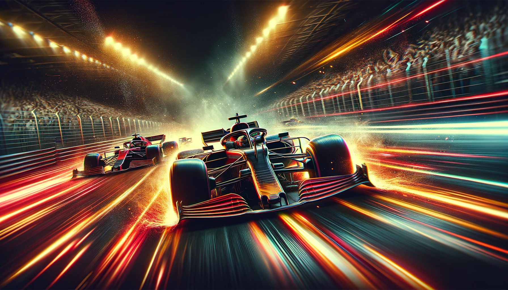

[](https://classroom.github.com/a/7gOmAfyW)
# COMP100 2024F PS5: Formula 1 Racing Simulation
### Deadline Friday, January 10, 2025 11:59 PM

Although sample test cases are provided, be aware that additional test cases may be used during grading.



### Overview
Develop a Formula 1 racing simulation in Python using OOP principles. This lab simulates various aspects of a Formula 1 race, including car performance, driver abilities, weather conditions, and random events over multiple laps.

### Formula 1 Drivers
1. **Lewis Hamilton:** A British driver, multiple world champion, known for his time with Mercedes. Holds the record for the most pole positions in F1 history. Experience: 9, Reaction Time: 0.2 seconds.
2. **Max Verstappen:** Dutch driver, known for his aggressive driving style and the youngest ever F1 winner. Drives for Red Bull Racing. Experience: 8, Reaction Time: 0.25 seconds.
3. **Sebastian Vettel:** German driver, four-time world champion, famous for his success at Red Bull Racing. Known for strategic driving. Experience: 8, Reaction Time: 0.24 seconds.
4. **Charles Leclerc:** Monegasque driver racing for Ferrari, noted for his quick ascent in F1 and impressive performances. Experience: 6, Reaction Time: 0.22 seconds.
5. **Daniel Ricciardo:** Australian driver, known for his overtaking skills and "shoey" celebration. Races for McLaren. Experience: 7, Reaction Time: 0.26 seconds.
6. **Lando Norris:** British driver, rising star in McLaren, known for his skillful driving and social media presence. Experience: 5, Reaction Time: 0.22 seconds.
7. **Fernando Alonso:** Spanish driver, two-time world champion, raced for Renault and Ferrari. Known for tactical intelligence. Experience: 9, Reaction Time: 0.27 seconds.
8. **Kimi Räikkönen:** Finnish driver, 2007 world champion with Ferrari, known for his straightforward attitude. Experience: 9, Reaction Time: 0.29 seconds.
9. **George Russell:** British driver, regarded as a future star, currently races for Mercedes. Known for his impressive qualifying performances. Experience: 5, Reaction Time: 0.21 seconds.

#### Legends
- **Michael Schumacher:** A German driver, seven-time world champion, best known for his time with Ferrari. Renowned for his exceptional skill and determination. Experience: 10, Reaction Time: 0.19 seconds.
- **Ayrton Senna:** A Brazilian driver, famous for his intense and fearless racing style, particularly in wet conditions. Raced for McLaren. Experience: 10, Reaction Time: 0.18 seconds.
- **Niki Lauda:** An Austrian driver, three-time world champion, raced for Ferrari and McLaren. Known for his comeback after a near-fatal crash. Experience: 9, Reaction Time: 0.20 seconds.

### Formula 1 Cars
1. **Mercedes F1 W11:** Dominant in the 2020 season, known for its excellent aerodynamics. Top Speed: 360 km/h, Acceleration: 2.4 s, Handling: 9.
2. **Ferrari SF1000:** Ferrari's 2020 contender, known for its powerful engine. Top Speed: 345 km/h, Acceleration: 2.5 s, Handling: 8.
3. **Red Bull RB16:** Max Verstappen's car in 2020, known for its agility. Top Speed: 350 km/h, Acceleration: 2.4 s, Handling: 10.
4. **McLaren MCL35:** 2020 car from McLaren, praised for its improved performance. Top Speed: 342 km/h, Acceleration: 2.6 s, Handling: 8.
5. **Renault R.S.20:** Renault's competitive car in 2020, known for its balanced performance. Top Speed: 338 km/h, Acceleration: 2.5 s, Handling: 7.
6. **AlphaTauri AT01:** The 2020 car from AlphaTauri, praised for its design and speed. Top Speed: 340 km/h, Acceleration: 2.6 s, Handling: 7.
7. **Racing Point RP20:** Known as the "pink Mercedes" for its design similarities, showed strong performance in 2020. Top Speed: 348 km/h, Acceleration: 2.5 s, Handling: 8.
8. **Alfa Romeo C39:** Competed in the 2020 season, known for its reliability. Top Speed: 335 km/h, Acceleration: 2.6 s, Handling: 6.
9. **Haas VF-20:** Haas's 2020 car, known for its strong straight-line speed. Top Speed: 340 km/h, Acceleration: 2.6 s, Handling: 6.
10. **Williams FW43:** The 2020 car from Williams, showing improvements over previous years. Top Speed: 330 km/h, Acceleration: 2.6 s, Handling: 5.

### Formula 1 Tracks
1. **Silverstone, UK:** Host of the British Grand Prix, famous for its fast corners. Lap Length: 5.89 km, Turns: 18, Difficulty: 7.
2. **Monza, Italy:** Known as the "Temple of Speed" for its long straights, hosting the Italian Grand Prix. Lap Length: 5.79 km, Turns: 11, Difficulty: 5.
3. **Marina Bay, Singapore:** Hosts F1's first night race, known for its challenging street circuit. Lap Length: 5.06 km, Turns: 23, Difficulty: 8.
4. **Spa-Francorchamps, Belgium:** Famous for the Eau Rouge corner, hosting the Belgian Grand Prix. Lap Length: 7.00 km, Turns: 19, Difficulty: 9.
5. **Suzuka, Japan:** Unique figure-eight layout, hosting the Japanese Grand Prix. Lap Length: 5.81 km, Turns: 18, Difficulty: 8.
6. **Monaco, Monte Carlo:** Known for its challenging street circuit, hosting the Monaco Grand Prix. Lap Length: 3.34 km, Turns: 19, Difficulty: 10.
7. **Circuit of the Americas, USA:** A mix of fast straights and tight corners, hosting the United States Grand Prix. Lap Length: 5.51 km, Turns: 20, Difficulty: 6.
8. **Interlagos, Brazil:** Known for its unpredictable weather, hosting the Brazilian Grand Prix. Lap Length: 4.31 km, Turns: 15, Difficulty: 7.
9. **Albert Park, Australia:** Runs around a lake in a public park, hosting the Australian Grand Prix. Lap Length: 5.30 km, Turns: 16, Difficulty: 6.
10. **Bahrain International Circuit, Bahrain:** Known for its desert setting, hosting the Bahrain Grand Prix. Lap Length: 5.41 km, Turns: 15, Difficulty: 5.

**DISCLAIMER:** Please note that the information provided for the Formula 1 Racing Simulation Assignment, including details about drivers, cars, and tracks, is for educational purposes only and may not accurately reflect real-world specifications.

**Note:** Use `simulator.py` to test your implementations and do not change the `random.seed(42)` code.

## Classes and Implementation

**Note:** Words "extend" and "inherit" are  are used which mean the same. When a class A "extends" class B, it means class A "inherits" from class B. Also, super = parent and sub = child class. 

### 1. Driver Class (10 Points)
- **Attributes:**
  - `name` (str): The driver's name.
  - `experience` (int): Experience level, 1-10 (1: Novice, 10: Expert).
  - `reaction_time` (float): Reaction time in seconds, between 0.1 and 1.0 (0.1: Expert, 1.0: Novice)

- **Methods:**
  - `__init__(self, name: str, experience: int, reaction_time: float) -> None`: Initializes the driver's class.
  - Raise `TypeError` if any of the arguments are of incorrect type. For example, if an `int` value is passed to `name`, raise the error.
  - Raise `ValueError` with an appropriate message, if either `experience` or `reaction_time` is not in the specified range.
  - `__str__(self) -> str`: Returns driver's details.
    - `<name>, Experience: <experience>, Reaction Time: <reaction_time>s`

```python
driver = Driver("Lewis Hamilton", 9, 0.2)
print(driver) #Output: "Lewis Hamilton, Experience: 9, Reaction Time: 0.2s"

driver2 = Driver("Lewis Hamilton", 9, "0.2") # Should raise TypeError
```

### 2. Car Class (10 Points)
- **Attributes:**
  - `model` (str): Car model.
  - `top_speed` (float): Maximum speed in km/h, between (318 - 360).
  - `acceleration` (float): Time to reach 100 km/h in seconds, between (2.4 - 2.6) seconds.
  - `handling` (int): Handling quality, 1-10 (1: Poor, 10: Excellent).

- **Methods:**
  - `__init__(self, model: str, top_speed: float, acceleration: float, handling: int) -> None`: Initializes the Car class.
    - Raise `TypeError` if any of the arguments are of incorrect type.
    - Raise `ValueError` if any of the arguments are either `None` or not in the specified ranges.
  - `add_component(self, component) -> None`: Adds an upgrade to the car (read Section 3)
    - call `component.apply(self)` to component upgrade to this car object.
  - `calculate_lap_time(track_length: float) -> float`: Calculates lap time based on car specs.
    - Formula:
    ```math
    \begin{equation}
      \begin{aligned}
        \text{Lap Time} &= \frac{\text{Track Length}}{\text{Speed Factor} \times \text{Acceleration Factor} \times \text{Handling Factor}} \\\\
        \textbf{where} \\\\
        \text{Speed Factor} &= \frac{\text{Top Speed}}{300} \\\\
        \text{Acceleration Factor} &= \frac{10}{\text{Acceleration}} \\\\
        \text{Handling Factor} &= \frac{\text{Handling}}{10}
      \end{aligned}
    \end{equation}
    ```

**Note:** These limits apply only when defining a new car. Implementing any improvements (in the following sections) may result in exceeding these limits. For instance, DRS might increase the speed beyond 360 km/h for a car initially defined with a maximum speed of 360 km/h.

```python
car1 = Car("Mercedes F1 W11", 360.0, 2.4, "9") # should raise TypeError as 'handling' is int

car2 = Car("Mercedes F1 W11", 360.0, 2.7, 9) # should raise ValueError as maximum acceleration allowed is 2.6

car3 = Car("Mercedes F1 W11", 360.0, 2.6, 10)
lap_time = car.calculate_lap_time(track_length)
print(lap_time) # It should be something 1.3368...
```

## Drag Reduction System (DRS)
DRS is a system used in Formula 1 to help reduce aerodynamic drag and thereby increase straight-line speed, which can be crucial for overtaking. It's typically used in designated zones on the racetrack during a race, under specific conditions:

- **Activation Condition:** For this assignment, the DRS can be activated on the following rules:
    - **Leader Cannot Use DRS**<br>
    The first-place car (lowest total time so far) **cannot** activate DRS.
    - **Within 1 Second of Car Ahead**<br>
    A car (not the leader) must be within 1 second of the next car up the road. This is typically checked by comparing cumulative times:
    
    ```math
    \begin{equation}
      \begin{aligned}
        \text{gap} = \text{time}_\text{driver} - \text{time}_\text{drive\_ahead}
      \end{aligned}
    \end{equation}
    ```
    
    - **Lap >= 2**<br>
    No DRS on the first lap.

    - **Weather = "Sunny"**<br>
    If it is "Rainy" or "Foggy", DRS remains off.

Create a `DRSCar` class that extends `Car` class.

### 3. DRSCar Class (10 Points)
- **Attributes:**
  - `drs_active` (bool): Indicates if the DRS is active or not. Set it to `False`, by default.

- **Methods:**
  - `__init__(self, model: str, top_speed: float, acceleration: float, handling: int) -> None`: Initializes the DRSCar class.
    - call super class's `__init__` with these params.
    - set `drs_active` to `False`
  - `activate_drs(self) -> None`: Activates the DRS
    - set `self.drs_active` to `True`.
  - `deactivate_drs(self) -> None`: Deactivates the DRS
    - set `self.drs_active` to `False`.
  - `calculate_lap_time(self, track_length: float) -> float`: Calculates lap time based on DRS state.
    - Make one change in the above formula: if DRS is active, increase speed factor by 7%.

## Adding Functionality to the Car
Here we are going to declare Component and its sub classes that can apply specific upgrades to a car. For example, a component can be a "Light Weight Body" that can help in decrease in acceleration time of the car, if applied. Multiple components can also be applied.

Component class is the base class and CompositeComponent class contains multiple upgrades for a car.

### 4. Component Class  (10 Points)
- **Attributes:**
  - `name` (str): Component name

- **Methods:**
  - `__init__(self, name: str) -> None`: Initializes the Component class.
  - `apply(self, car: Car) -> None`: Abstract method.
    - Raise `NotImplementedError` with an appropriate message, as it will be implemented in sub-classes.
  - `__add__(self, other) -> CompositeComponent`: Overload + operator to add new components.
    - Raise `TypeError` with an appropriate message, when adding a non-`Component` object.
    - Create `CompositeComponent(self, other)` and return it.

### 4.1.1. CompositeComponent Class
Inherits from `Component` class.

- **Attributes:**
  - `components`: Components that are passed in the constructor. They can be 0, 1, or more.

- **Methods:**
  - `__init__(self, *components) -> None`: Initializes the CompositeComponent class.
    - call `super().__init__("Composite")` to assign component name in the super class.
  - `apply(self, car: Car) -> None`: Abstract method.
    - For each `self.components` call `apply(car)` method. This will apply all components to the car.

**Note:** When we use `*` operator with function arguments, it means unlimited number of arguments (even none) can be passed to the function. Here `*components` expects multiple components, for example when executing line 30: `setup_1 = TurboCharge() + LightweightBody() + AdvancedTires()` in `simulator.py` file, it passes 3 arguments.

### 4.2.1. AdvancedTires Class (5 Points)
Inherits from `Component` class.

- **Attributes:**

- **Methods:**
  - `__init__(self) -> None`: Initializes the AdvancedTires class.
    - call `super().__init__("AdvancedTires")`
  - `apply(self, car: Car) -> None`: Override the abstract method `apply`.
    - Improve the overall car's handling by 2 -> `car.handling += 2`

### 4.2.2. TurboCharge Class (5 Points)
Inherits from `Component` class.

- **Attributes:**

- **Methods:**
  - `__init__(self) -> None`: Initializes the TurboCharge class.
    - call `super().__init__("TurboCharge")`
  - `apply(self, car: Car) -> None`: Override the abstract method `apply`.
    - Increase top speed by 5%

### 4.2.3. LightweightBody Class (5 Points)
Inherits from `Component` class.

- **Attributes:**

- **Methods:**
  - `__init__(self) -> None`: Initializes the LightweightBody class.
    - call `super().__init__("LightweightBody")`
  - `apply(self, car: Car) -> None`: Override the abstract method `apply`.
    - Improve acceleration time by 5%

**Note**: When increasing top speed there is a positive increase, when improving acceleration time it is a decrease in time. Think how it can be done.

```python
enhanced_setup = TurboCharge() + LightweightBody() + AdvancedTires() # This should call __add__ overridden method

race_car = Car("Custom F1 Car", 330, 2.4, 8)
race_car.add_component(enhanced_setup) # This should call add_component of race_car

# Now race_car should have upgrades.
```

## Track and Race Classes with Information

### 5. Track Class (10 Points)
- **Attributes:**
  - `name` (str): Track name.
  - `lap_length` (float): Lap length in km, between (3.33 - 7.0) kms.
  - `number_of_turns` (int): Total turns, between (10 - 27).
  - `difficulty` (int): Difficulty level, 1-10 (1: Easy, 10: Hard).

- **Methods:**
  - `__init__(self, name: str, lap_length: float, number_of_turns: int, difficulty: int) -> None`: Initializes the Track class.
    - Again, check for `ValueError` and `TypeError`.
  - `__str__(self)`: Returns track details.
    - `<name>, Lap Length: <lap_length> km, Number of Turns: <number_of_turns>, Difficulty: <difficulty>`

```python
track1 = Track(123, 5.79, 11, 5) # Shoud raise TypeError as 'name' should be str

track2 = Track("Monza", 5.79, 30, 5) # Should raise ValueError as maximum number of turns allowed are 27

track3 = Track("Monza", 5.79, 11, 5)
print(track3) # Output: "Monza, Lap Length: 5.79 km, Number of Turns: 11, Difficulty: 5"
```

### 6. Race Class (35 Points)
- **Attributes:**
  - `track` (Track): Track for the race.
  - `drivers` (list of Driver): Drivers in the race.
  - `cars` (list of Car): Cars in the race.
  - `number_of_laps` (int): Total number of laps in the race.
  - `weather_condition` (str): "Sunny", "Rainy", or "Foggy"

- **Methods:**
  `__init__(self, track: Track, drivers: list[Driver], cars: list[Car], weather_condition: str) -> None`: Initializes the Race class.
    - Again, check for `TypeError` and `ValueError`. Moreover, `weather_condition` can only be either "Sunny", "Rainy", or "Foggy".
  - `start_race(self) -> list[tuple[Driver, float]]`: Simulates the race.
    - return the `list` of drivers and their race time, sorted by time

### Race Simulation Formula:
1. **Initialization:**
    - Set initial race conditions, including weather.
    - Assign cars to drivers and prepare for the race start.
2. **Lap Simulation:**
    - For each lap (implement a `for` loop that iterates over each driver):
        - **Determine Race Order:**
            - Sort drivers by their **cumulative** race time to see who is leading and the current gaps. (It's upto you how you want to implement it)
        - **DRS Activation:**
            - DRS can be activated if all of the following conditions are met:
                - car is `DRSCar`.
                - weather is "Sunny".
                - Lap is 2nd or above.
                - not a race leader.
                - if they are within `1.0s` of the next car ahead.
            - Activate DRS, if above conditions are met.
        - **Base Lap Time Calculation:** Use `Car.calculate_lap_time(track_length)`.
        - **Driver Skill Adjustment:** Reduce lap time based on driver experience (e.g., subtract 0.2% per experience level).
        - **Driver Reaction Time:** Add the driver's reaction time to the lap time.
        - **Weather Impact:**
            - Sunny: No change.
            - Rainy: Increase lap time by 10%
            - Foggy: Increase lap time by 15%
        - **Random Event:** Check for random event each lap and add the respective time penalty if an event occurs. Read "Implementing Random Events" and check `if random.random() < 0.2` before applying following uncertainties.
            - **Technical Glitch:** Add 5-15 seconds to lap time.
            - **Tire Degradation:** Add 3-10 seconds to lap time.
            - **Track Obstruction:** Add 4-8 seconds to lap time.
            - **Safety Car Period:** Add flat 20 seconds to lap time.
            - **Pit Stop Condition:** Add 10-30 seconds to lap time if `experience < 3`.
        - **DRS Deactivation:**
            - Deactivte DRS if the car is DRS car and the DRS is active.
3. **Total Race Time:**
    - Sum the lap times for each driver across all laps, including time penalties from random events.
4. **Winner Determination:**
    - The driver with the lowest total time after all laps is the winner. Do not worry about if two or more drivers have same total time.

### Implementing Random Events
Random events are unexpected occurences that can impact the outcome of each lap during the race. These events should be implemented in a way that occasionally alters the standard lap time for a driver.

#### Types of Random Events:
1. **Technical Glitch:** A sudden technical issue with the car, adding 5-15 seconds to the lap time.
2. **Tire Degradation:** Accelerated wear and tear of tires, adding 3-10 seconds to the lap time.
3. **Track Obstruction:** Obstacles or slower cars on the track, adding 4-8 seconds.
4. **Safety Car Period:** A safety car deployed on the track, adding a flat 20 seconds.
5. **Pit Stop Condition:** For drivers with `experience < 3`, there is a 10% chance per lap that they will need a pit stop, adding 10-30 seconds.

#### Implementation Steps:
1. **Event Probability Determination:**
    - At the beginning of each lap, decide whether a random event occurs. This can be done using a random number generator.
    - For example, you might decide there is a 20% chance for any event to occur on each lap.
2. **Selecing an Event:**
    - If an event is to occur, randomly select which event it will be.
    - This selection can be done by `event_number = random.randint(1, 5)`. Select `event_number` such as 2 corresponds to *Tire Degradation*.
3. **Applying the Event:**
    - Once an event is selected, apply the corresponding time penalty to the driver's lap time.
    - This penalty should be added to the lap time calculated from the car's performance and the driver's skills.
    - For example, if the `event_numer` is 1 and you need to apply *Technical Glitch*, you would call `random.randint(5, 15)`. It should give you a number between 5 and 15 (inclusive) which you should add to current lap time.

**Note:** You are provided with `random_event_time(self, experience)` function that you need to complete. You need to call it in your **Race Simulation Formula** in the lap-time calculation `loop` if the probability is 20% (`if random.random() < 0.2`) and add the random event time to lap's time.

### Example Usage
```python
track = Track("Monza", 5.79, 11, 5)
drivers = [Driver("Lewis Hamilton", 9, 0.2), Driver("Max Verstappen", 8, 0.25)]
cars = [Car("Mercedes F1 W11", 360.0, 2.4, 9), Car("Red Bull RB16", 350.0, 2.4, 10)]
number_of_laps = 5
race = Race(track, drivers, cars, number_of_laps, "Sunny")

results = race.start_race()

results[0][1] # 13.049286 - it could be different for you because of random number
```
